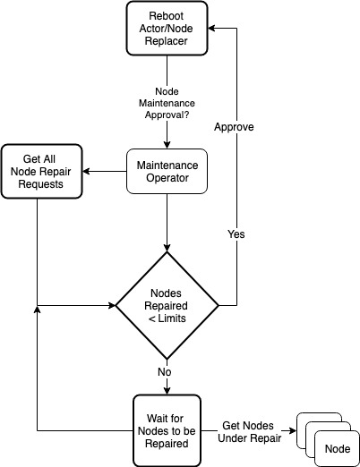

# repairman
Coordinate infrastructure maintenance on kubernetes across multiple actors

## Introduction

Infrastructure management has become core of Kubernetes eco system, example cluster-api project aiming to manage infrastructure lifecycle, node-problem detector aimed at detecting infrastructure problems and many more. Infrastructure maintenance never consider the application workloads and may cause more problems than issues it tends to solve. Having a maintenance coordinator makes sure that your infrastructure maintenance is safe by honoring not only infrastructure failing limits (X/Y nodes are allowed to be repaired), but also honoring application workload downtime.
 
## Design:

You can set a maintenance limit (e.g. 5%) which is the max allowable maintenance to occue at once cluster-wide.

We define 2 CRDs

- MaintenanceLimit CustomResourceDefinition
  - Defines cluster-wide maintenance limits for kubernetes Node resource.(v1)
  - Optionally support Cordon and Drain, also support grace period after such operation(v1).
  - Optionally support infra drains (example detach attached storage), also support grace period after such operation(v1).
  - Define timeouts for Approved->InProgress, if the state isnt moved within X seconds it will reject the repair and allow something else(v1).
  - Define timeouts for InProgress>Completed, if the state isnt moved within X seconds it will reject the repair and allow something else(v1).
  - Defines cluster-wide maintenance limits for other kubernetes resource, e.g Deployment. Daemonset etc(v2).
  - Defines optionally timeout between each operation(v2)
  - Define configurable limits for certain label selectors(v2)
- MaintenanceRequest CustomResourceDefinition
  - Actor proposes a maintenance action for a specific resource (State=Pending)
  - Actor waits for State=Approved, updates state to State=Pending.
  - Once actor completed an action updates state to State=Completed.
  - Maintenance operator looks at the list of requests for repairs and it either approves or delays  the request  for repair
  - Before the request runs it double checks to ensure it is still safe to do so

